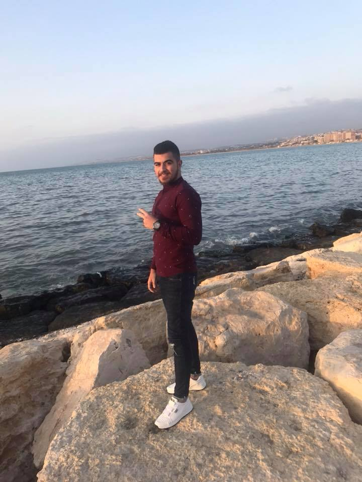

<h1>CV</h1> 

 

>ALI RAHHAL

>alih.rahhal@hotmail.com

>Mobile: 0096170146434

>Beirut-Lebanon

 
 

# **Objevtive:** #

To become a successful professional in the field of Computer Science and Information Technology by channelizing my technical Knowledge and skills to ensure personal and professional growth and to contribute to the prosperity of the organization. 

# **Credentials:** #

Currently Graduated.

# **Education** #

Lebanese International University (Beirut) 2016-2020 

**Major:** Computer Science 

**Graduated:** Spring 2020-2021

**GPA:** 3.32

# **Skills:** #

- Demonstrated knowledge of web technologies, such as HTML, CSS and Javascript.

- Ability to work independently and multi-task effectively 

-  Demonstrated understanding of projects from the perspective of both client and business .

-  Strong attention to detail 

- NetBeans: using Java 

- Android Studio: using  java 

- Good understanding for the OOP (object-oriented-programming)

# **Experience** #

1. check my website:

This is my website is showing you some of my web development with some features using html css javascript using wordpress:
[rahalinho project](www.rahalinho.wordpress.com)

2. building a website Template  using React js API and HTML and CSS 
visit my project from github:[first template](https://github.com/rahhalali/Template_html5_css3).

3. building a website Template using HTML ,CSS and JavaScript
visit my project from github:[second template](https://github.com/rahhalali/Template/tree/master)

## Languages 

**langauge-skills:**

Arabic(Native)

English(Advanced):Speaking and writing.

# **Programming-langauges:** #

**JAVASCRIPT** ,**HTML** ,**CSS**,**PHP**,**OOP**,**SQL**,**MYSQL**,**JAVA**,
**REACT.JS**

